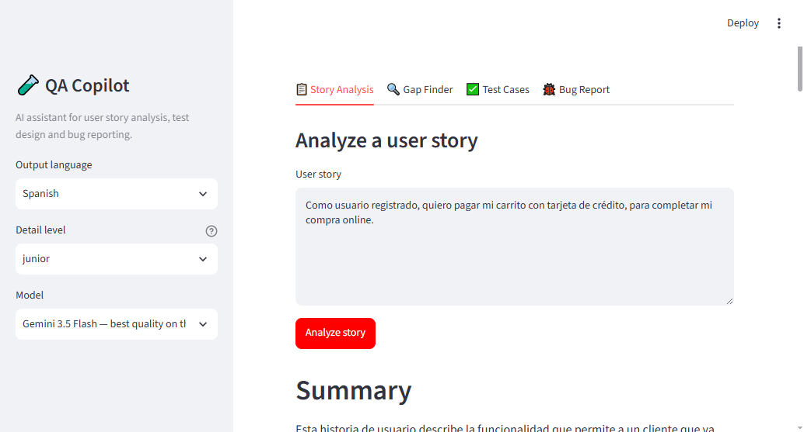
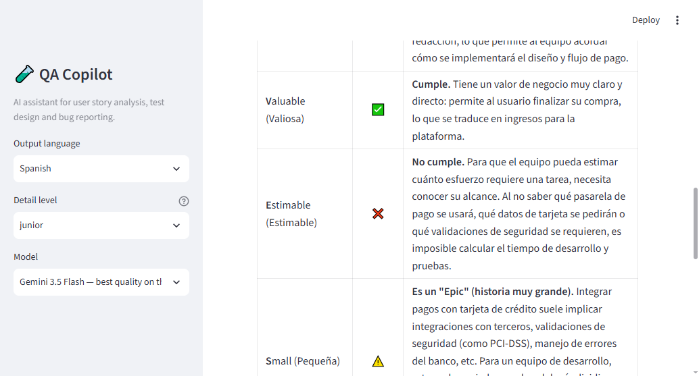

# 🧪 QA Copilot

An AI-powered assistant for manual QA work. Paste a user story and get a
professional analysis, gap detection and test cases; describe a defect
informally and get a ready-to-file bug report.

Built with Python, [Streamlit](https://streamlit.io) and the
[Google Gemini API](https://ai.google.dev) (free tier — no credit card needed).



## Features

| Tool | Input | Output |
|---|---|---|
| 📋 Story Analysis | User story | Summary, acceptance criteria, INVEST assessment, testability verdict |
| 🔍 Gap Finder | User story | Ambiguities, missing criteria, edge cases, questions for the PO |
| ✅ Test Cases | User story | Gherkin scenarios + classic test case table (downloadable as CSV) |
| 🐞 Bug Report | Informal defect description | Professional bug report with severity, priority and repro steps |

Every tool supports **Spanish or English output** and two detail levels:
**junior** (explains the reasoning — great for learning) and **senior**
(concise, artifacts only).

The INVEST assessment explains each verdict, so weak stories become a
learning opportunity:



## How it works

The prompts that power each tool live as plain Markdown files in
[`prompts/`](prompts/) — the repo doubles as a QA prompt library you can read,
reuse or adapt. The app fills in your input, sends it to Gemini and renders
the result.

## Setup

Requirements: Python 3.11+ and a free Google Gemini API key
([create one here](https://aistudio.google.com) — no credit card required).

```bash
git clone https://github.com/<your-user>/qa-copilot.git
cd qa-copilot
pip install -r requirements.txt
copy .env.example .env    # on Linux/macOS: cp .env.example .env
# paste your API key into .env
streamlit run app.py
```

The app opens at `http://localhost:8501`.

## Try it without an API key

The [`examples/`](examples/) folder contains sample user stories and real
pre-generated outputs, so you can see the result quality directly on GitHub.

## Running the tests

```bash
python -m pytest
```

## Roadmap

- **Phase 2 — Accounts & history:** simple login, SQLite storage of every
  analysis, and a history browser.
- **Phase 3 — Jira / Azure DevOps integration:** create generated bug reports
  as Jira issues in one click, plus a management dashboard with metrics pulled
  from Jira/Azure (bugs found vs. fixed per sprint, test cases per story).

## License

MIT
